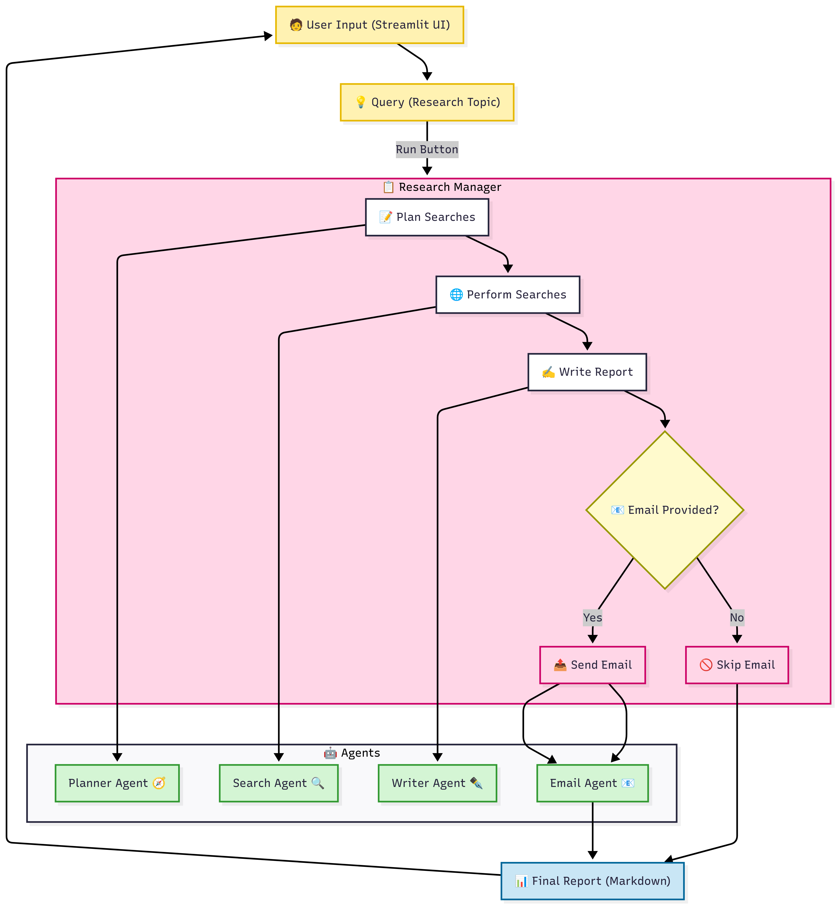
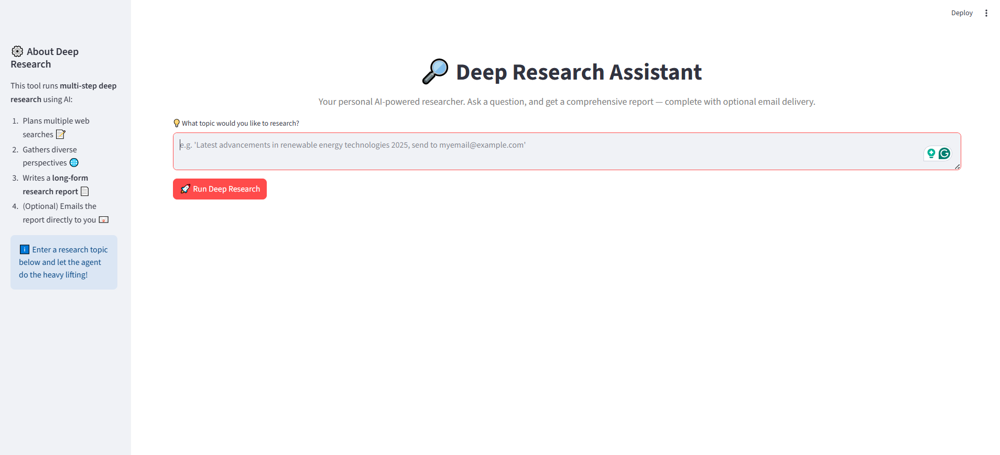
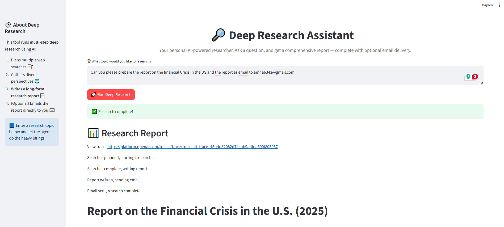
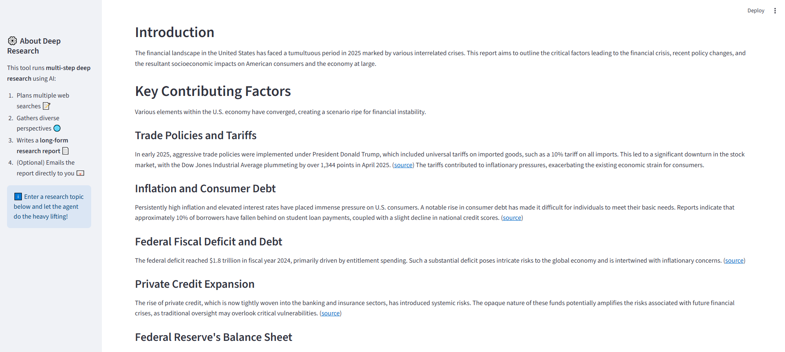
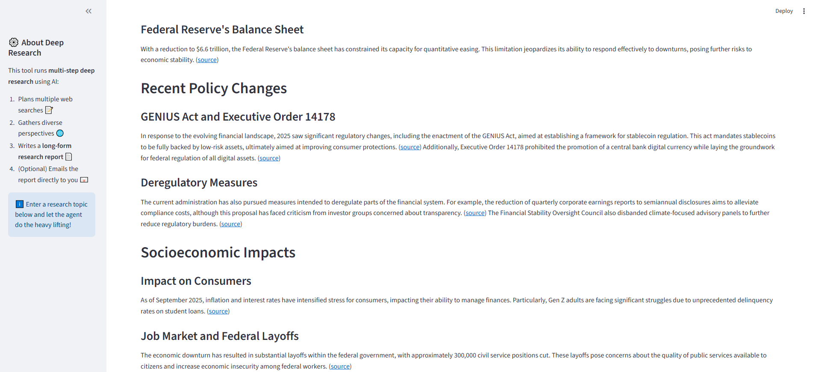
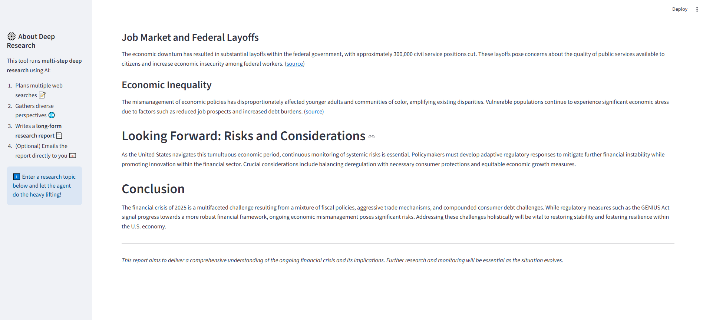
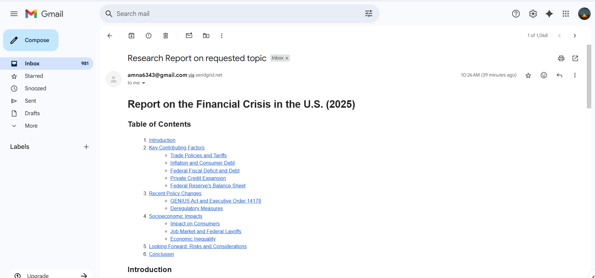
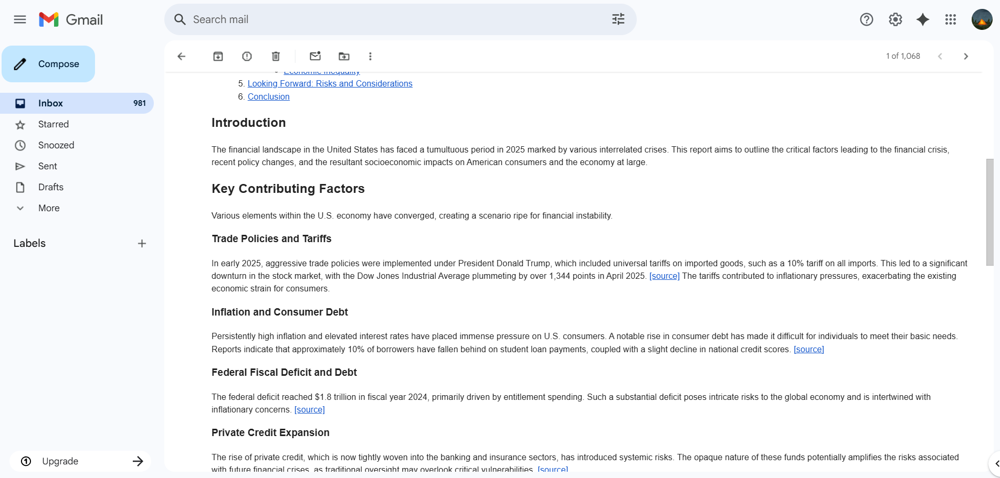

# 🔎 Deep Research Assistant

Your personal AI-powered researcher that plans searches, gathers diverse perspectives, writes long-form reports, and optionally emails them directly to you.
Built with Streamlit, OpenAI, and SendGrid.


## 🧩 Features

- 📝 Planner Agent – designs multiple distinct web searches.
- 🌐 Search Agent – performs concise, multi-perspective searches.
- ✒️ Writer Agent – synthesizes findings into a detailed Markdown report.
- 📧 Email Agent – converts reports to HTML and sends via SendGrid.
- ⚡ Async Execution – performs searches in parallel for speed.
- 🖥️ Streamlit UI – simple and elegant interface for interaction.


## 🏗️ Architecture



## 📸 UI Screenshots
<p align="center">
  
  
</p>
<p align="center">
  
  
  
</p>

<p align="center">
  
  
</p>

## 📂 Project Structure

```bash
app/
│── screenshots/         # UI screenshots
│── user_agents/         # Multi-agent modules
│   ├── planner_agent.py
│   ├── search_agent.py
│   ├── writer_agent.py
│   ├── email_agent.py
│   └── __init__.py
│── research_manager.py  # Core research orchestration
│── deep_research.py     # Streamlit entrypoint
│── config.py            # Config & env vars
│── FlowDiagram.png      # Visual flow diagram
│── .env                 # Local API keys (ignored in git)

```


## ⚙️ Setup & Installation

#### 1. Clone the repo
```bash
git clone git@github.com:hammuneer/deep-research-assistant.git
cd deep-research-assistant/app
```

#### 2. Create & activate environment
```bash
python -m venv openai_env
source openai_env/bin/activate   # Linux/Mac
openai_env\Scripts\activate      # Windows
```

#### 3. Install dependencies
```bash
pip install -r requirements.txt
```

#### 4. Set environment variables (.env)
```bash
OPENAI_API_KEY=your_openai_key
OPENAI_MODEL=gpt-4o-mini
SENDGRID_API_KEY=your_sendgrid_key
SENDER_EMAIL=your_verified_sender@example.com
```

## 🚀 Run the App
```bash
streamlit run deep_research.py
```
Then open 👉 http://localhost:8501 in your browser.


## 📧 Email Sending

If the query includes an email address, the report will also be sent via SendGrid.
Example query:
```bash
Latest advancements in renewable energy 2025, send to myemail@example.com
```