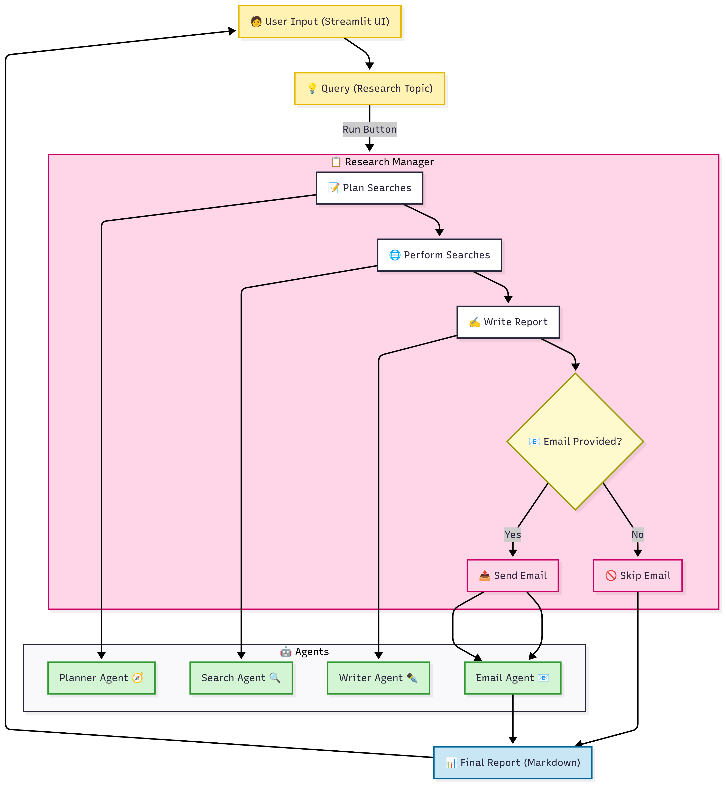
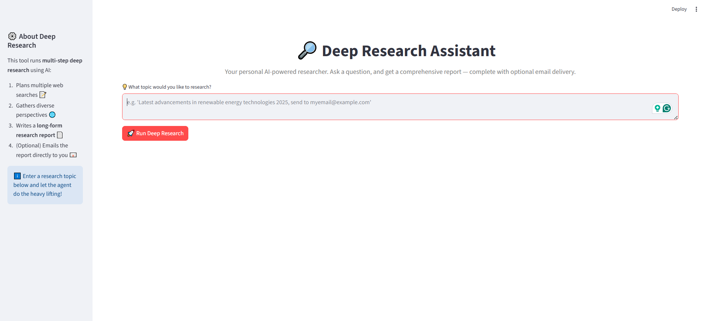
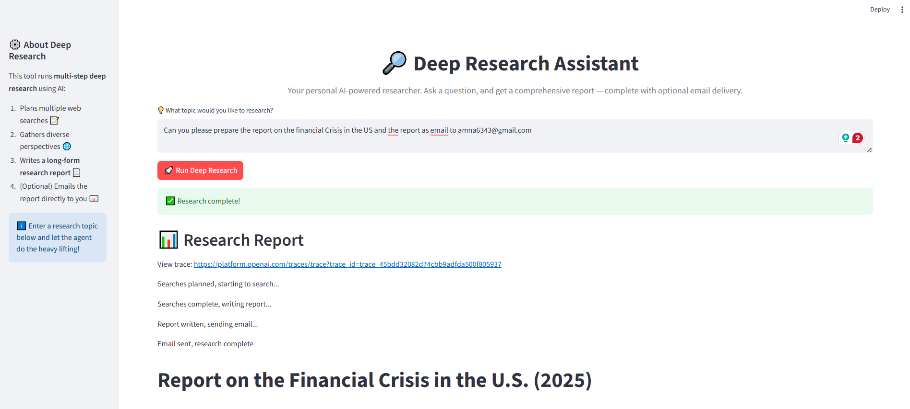
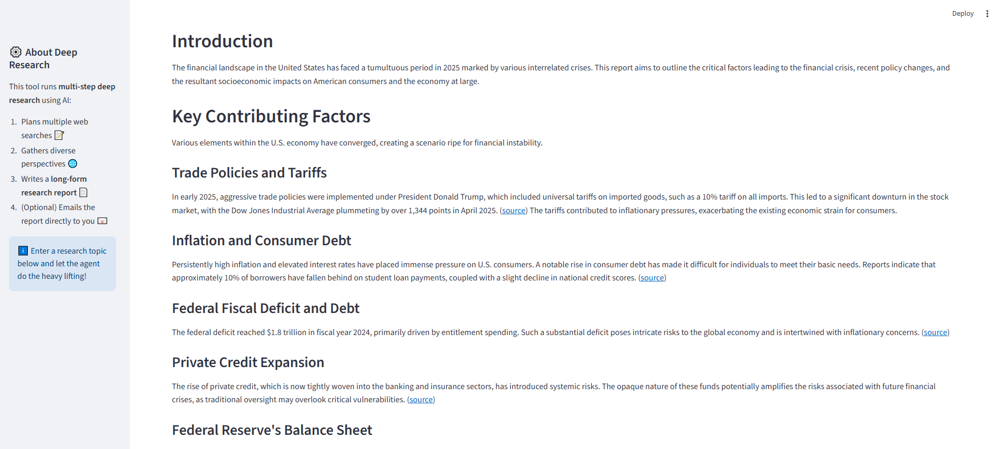
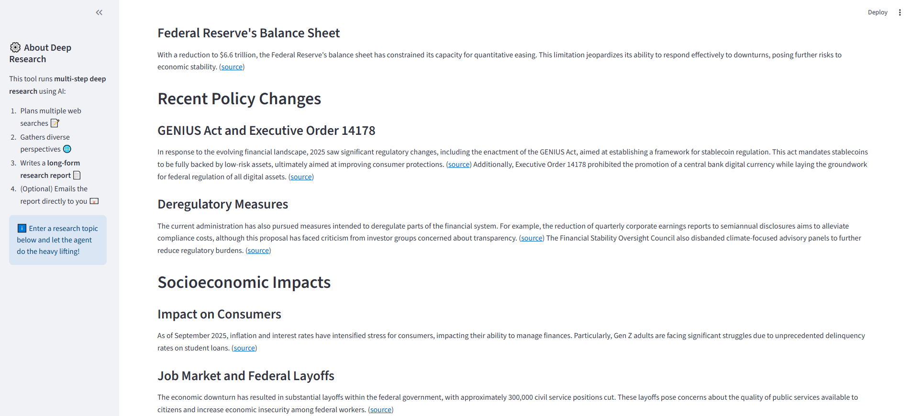
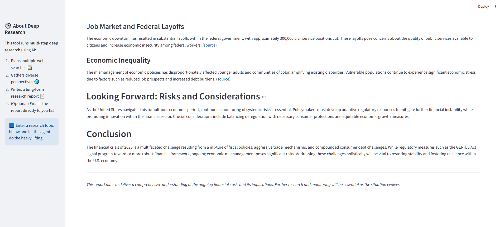
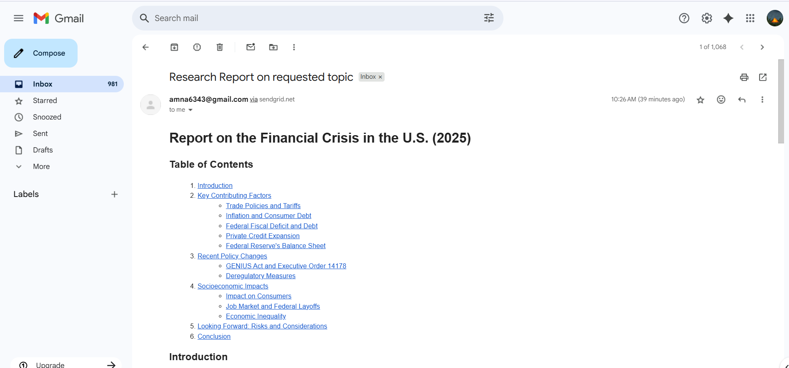
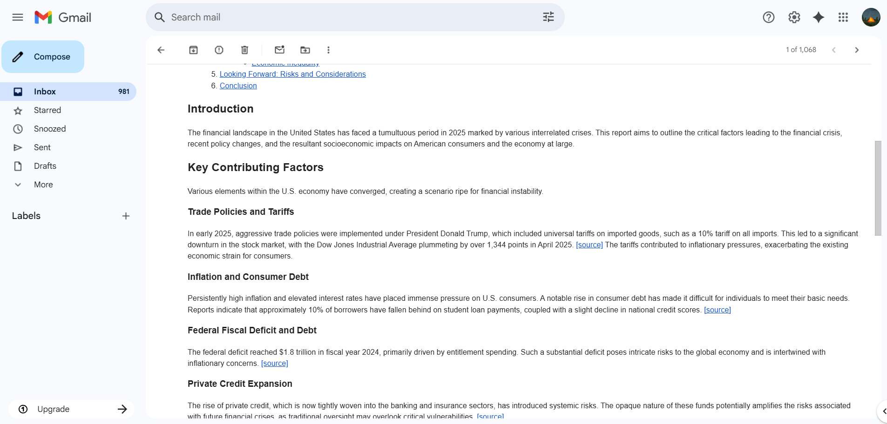

# 🔎 Deep Research Assistant

Your personal AI-powered researcher that plans searches, gathers diverse perspectives, writes
long-form reports, and optionally emails them directly to you.
Built with Streamlit, the OpenAI Agents SDK, and SendGrid.

## 🧩 Features

- 📝 Planner Agent – designs multiple distinct web searches.
- 🌐 Search Agent – performs concise, multi-perspective searches.
- ✒️ Writer Agent – synthesizes findings into a detailed Markdown report.
- 📧 Email Agent – converts reports to HTML and sends via SendGrid.
- ⚡ Async Execution – performs searches in parallel for speed.
- 🖥️ Streamlit UI – simple and elegant interface for interaction.

## 🏗️ Architecture



```
User query
    │
    ▼
PlannerAgent  ──►  N search terms + optional receiver email
    │
    ▼  (parallel)
SearchAgent × N  ──►  concise summaries
    │
    ▼
WriterAgent  ──►  ReportData (short_summary, markdown_report, follow_up_questions)
    │
    ▼ (only if a valid email was extracted)
EmailAgent  ──►  SendGrid
```

## 📸 UI Screenshots

<p align="center">
  
  
</p>
<p align="center">
  
  
  
</p>
<p align="center">
  
  
</p>

## Project structure

```
.
├── app.py                          # Streamlit entry point
├── src/deep_research/
│   ├── config.py                    # loads env vars (OpenAI, SendGrid)
│   ├── research_manager.py          # orchestrates the plan/search/write/email pipeline
│   └── agents/
│       ├── planner_agent.py         # query -> search plan + optional receiver email
│       ├── search_agent.py          # one search term -> concise summary
│       ├── writer_agent.py          # summaries -> long-form Markdown report
│       └── email_agent.py           # report -> HTML email via SendGrid
├── tests/
├── FlowDiagram.png
├── pyproject.toml
└── requirements.txt
```

## Getting started

### Prerequisites

- Python 3.10+
- An [OpenAI API key](https://platform.openai.com/api-keys)
- A [SendGrid API key](https://sendgrid.com/) and a verified sender email (only required if you
  want email delivery)

### Installation

```bash
git clone https://github.com/hammuneer/deep-research-assistant.git
cd deep-research-assistant
python -m venv .venv && source .venv/bin/activate
pip install -e ".[dev]"
```

### Configuration

```bash
cp .env.example .env
# then edit .env: set OPENAI_API_KEY; SENDGRID_API_KEY/SENDER_EMAIL are optional
```

### Run

```bash
streamlit run app.py
```

Open the local URL Streamlit prints (default: http://localhost:8501). If your query includes an
email address, the report is also sent via SendGrid, e.g.:

> Latest advancements in renewable energy 2025, send to myemail@example.com

## Testing

```bash
pytest
```

## Security considerations

- The email agent sends to whatever address the planner agent extracts from the user's query,
  using your SendGrid account and verified sender. If you deploy this publicly, that's effectively
  an open relay — anyone can get your app to email an arbitrary third party. The email format is
  validated before sending, but there's no ownership/consent check on the recipient. Add rate
  limiting and/or a confirmation step before using this beyond a personal/demo deployment.
- If you hit local TLS certificate errors on macOS (a common Python.org installer issue), fix it
  by running `pip install --upgrade certifi` and pointing Python at that bundle
  (`export SSL_CERT_FILE=$(python -m certifi)`) rather than disabling certificate verification.

## License

See [LICENSE](LICENSE).
